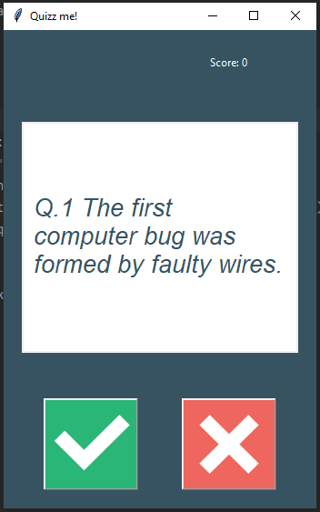

# Quiz Me! 🎉 - True/False Quiz App  

 😄  

## Overview 🌟  
Quiz Me! 😎 - a fun Tkinter GUI quiz app! 🎮 Fetches true/false Qs from OpenTDB API 📡. OOP-based! 🛠️ With sound effects 🎵!  

## Features ✨  
- 10 random Qs 🎲  
- True/False buttons ✅❌  
- Feedback: Green ✔️/Red ❌ + sounds 🎶  
- Score tracker 📊  
- Ends w/ message 🎉  

## Requirements 🛠️  
- Python 3.x 🐍  
- Tkinter 🎨  
- `requests`, `playsound3` 📦  

## Installation 🔧  
1. `git clone https://github.com/Juda-Tech-Green/quizz_gui_app` 📥  
2. `pip install requests playsound3` 🚀  

## Usage 🎮  
- Run: `python main.py` 🖱️  
- Click ✅❌, get feedback 🌈, next Q! 🔄  

## Structure 🗂️  
.
├── .git/
├── images/ ✅❌
├── sounds/ 🎵
├── data.py 📡
├── main.py 🚀
├── preview.jpg 😄
├── question_model.py 🧩
├── quiz_brain.py 🧠
├── ui.py 🎨

## API 🌐  
- OpenTDB: `https://opentdb.com/api.php?amount=10&type=boolean` 📋  
- Unescapes chars 🌐  

## Customization 🎨  
- Change Qs in `data.py` 🔧  
- Swap images/sounds 🎵  

## Limits ⚠️  
- Needs internet 🌐  
- 10 Qs max 🎲  
- No tokens 🔑  

## Credits 🙌  
- OpenTDB 📚 (CC BY-SA 4.0)  
- Python 🐍, Tkinter 🎨  

## License 📜  
MIT - Fork it! 🚀 😄  